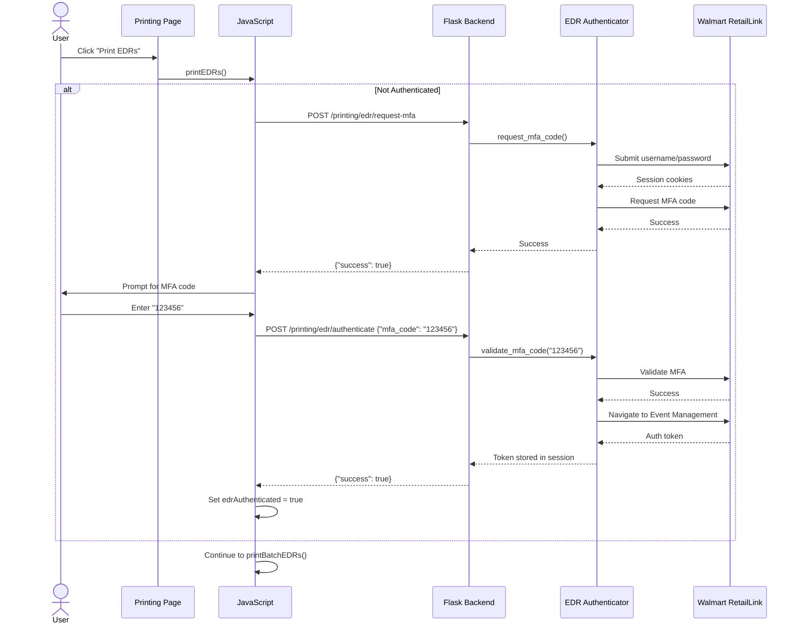
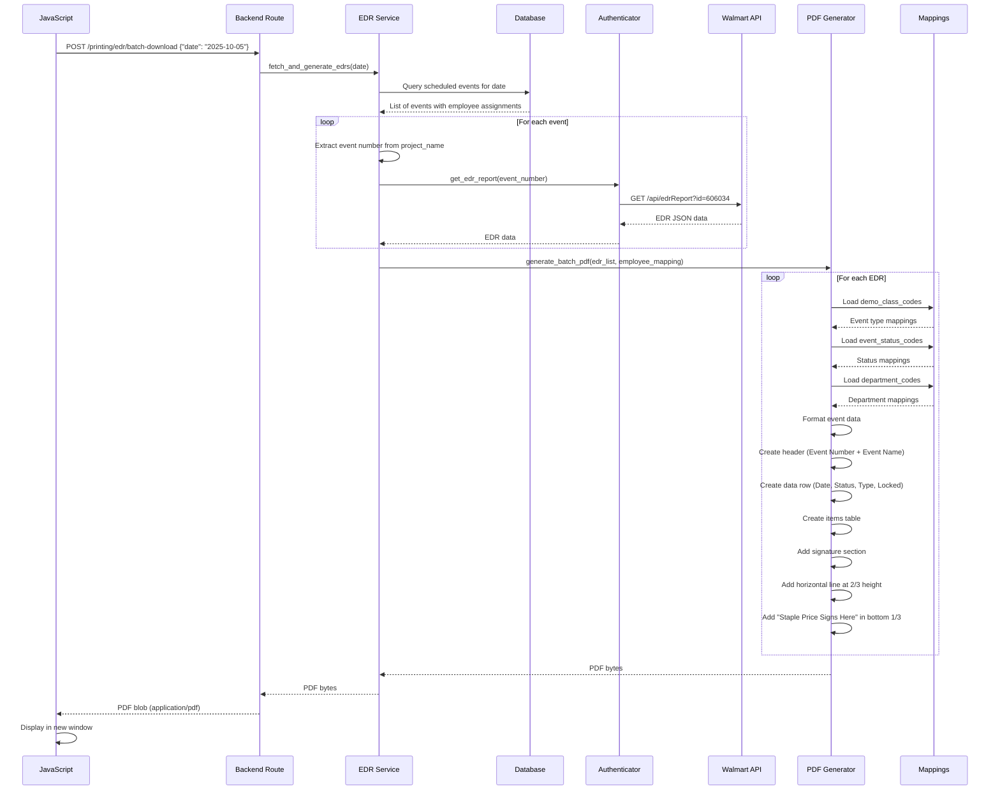

# EDR/Walmart RetailLink Integration Architecture

## Document Information
- **Version:** 1.0
- **Date:** 2025-10-05
- **Author:** Winston (Architect Agent)
- **Status:** Draft - Awaiting Review

## 1. Executive Summary

This document outlines the architecture for integrating Walmart RetailLink Event Detail Report (EDR) functionality into the existing Flask Schedule WebApp Printing page. The integration will enable users to authenticate with Walmart RetailLink, fetch EDR data for events, and generate formatted PDF reports matching the application's design theme.

### Key Objectives
- **Seamless Authentication**: Integrate multi-factor authentication workflow into existing Printing page
- **Automated Data Retrieval**: Fetch EDR reports from Walmart RetailLink API
- **Professional PDF Generation**: Create formatted PDFs with consistent branding and layout
- **Batch Processing**: Support both single-event and batch (daily) EDR generation
- **User Experience**: Maintain existing UI patterns and color scheme

## 2. Current State Analysis

### 2.1 Existing Components

#### EDR Downloader (Standalone)
**Location:** `edr_downloader/`

**Components:**
- `authenticator.py` - Multi-step authentication flow
- `edr_auth.py` - Authentication service
- `pdf_generator.py` - ReportLab PDF generation
- `app.py` - Flask application wrapper
- `models.py` - Data models

**Authentication Flow:**
1. Submit username and password
2. Request MFA code to phone
3. Validate MFA code (6-digit)
4. Register page access with Walmart
5. Navigate to Event Management system
6. Authenticate with Event Management API
7. Extract auth token from cookies

**Current PDF Format:**
- Uses Product Connections colors (#2E4C73, #1B9BD8)
- Event Number + Event Name header row
- Event Date, Event Type, Status, Locked data row
- Item details table
- Signature section
- "Place Price Signs Here" box (2.5" height, but not positioned correctly)

#### Printing Page
**Location:** `scheduler_app/templates/printing.html`

**Current Features:**
- Daily schedule printing
- Weekly schedule printing
- Employee schedule printing
- Instruction manuals printing
- **EDR Reports section (partially implemented)**

**Color Scheme:**
- Primary Dark Blue: `#2E4C73`
- Light Blue: `#1B9BD8`
- Consistent across all schedules

#### Mappings
**Location:** `mappings/`

**Available Mappings:**
- `demo_class_codes.py` - Event type code to description mappings (e.g., 3 = "STANDARD")
- `event_status_codes.py` - Event status code to description mappings (e.g., 2 = "APPROVED")
- `department_codes.py` - Department number to name mappings (e.g., 1 = "CANDY - SNACKS - BUSINESS")

### 2.2 Gap Analysis

**What's Missing:**
1. ❌ Integration of authentication flow into Printing page
2. ❌ Backend routes for EDR authentication and data retrieval
3. ❌ Updated PDF format matching new specifications
4. ❌ Proper 2/3 page height horizontal line
5. ❌ Bold formatting for "Locked" yes/no value
6. ❌ Removal of consolidated report header
7. ❌ Correct field mapping (Event Name vs Event Type confusion)

## 3. Architecture Design

### 3.1 High-Level Architecture Diagram

```mermaid
graph TB
    subgraph "Frontend"
        A[Printing Page UI] -->|User Action| B[JavaScript Controller]
        B -->|Display| C[Loading Modal]
    end

    subgraph "Flask Backend"
        D[/printing/edr/request-mfa] --> E[EDR Service]
        F[/printing/edr/authenticate] --> E
        G[/printing/edr/batch-download] --> E
        E -->|Uses| H[EDR Authenticator]
        E -->|Generates| I[PDF Generator]
    end

    subgraph "External Services"
        J[Walmart RetailLink Auth]
        K[Walmart Event Management API]
    end

    subgraph "Data Layer"
        L[(Schedule Database)]
        M[Mapping Files]
    end

    B -->|POST| D
    B -->|POST| F
    B -->|POST| G

    H -->|Auth Request| J
    H -->|MFA Validation| J
    H -->|Fetch EDR| K

    E -->|Query Events| L
    I -->|Read| M

    G -->|PDF Blob| B
    B -->|Display| N[PDF Viewer]
```

### 3.2 Component Architecture

#### 3.2.1 Frontend Components

**Printing Page UI (`scheduler_app/templates/printing.html`)**
- **Responsibility**: Provide user interface for EDR printing
- **Key Features**:
  - Radio buttons for single vs batch mode
  - Date picker for batch mode
  - Event ID input for single mode
  - Print button with authentication trigger
- **Integration Points**:
  - Backend authentication endpoints
  - Backend batch download endpoint
  - Loading modal for UX feedback

**JavaScript Controller (in `printing.html` `<script>` section)**
- **Responsibility**: Orchestrate authentication and EDR retrieval
- **Key Functions**:
  - `printEDRs()` - Main entry point
  - `authenticateWalmartEDR(callback)` - Handle auth flow
  - `printBatchEDRs()` - Batch EDR generation
  - `printSingleEDR()` - Single EDR generation
  - `showLoading(message)` / `hideLoading()` - UX feedback
- **State Management**:
  - `edrAuthenticated` - Boolean flag for session state

#### 3.2.2 Backend Components

**EDR Routes** (New: `scheduler_app/routes/edr.py` or extend `scheduler_app/routes/printing.py`)
- **Responsibility**: Handle HTTP requests for EDR operations
- **Key Endpoints**:

```python
# 1. Request MFA Code
POST /printing/edr/request-mfa
Response: {"success": True, "message": "MFA code sent"}

# 2. Authenticate with MFA Code
POST /printing/edr/authenticate
Request: {"mfa_code": "123456"}
Response: {"success": True, "message": "Authenticated"}

# 3. Batch Download EDRs
POST /printing/edr/batch-download
Request: {"date": "2025-10-05"}
Response: PDF Blob (application/pdf)
```

**EDR Service** (New: `scheduler_app/services/edr_service.py`)
- **Responsibility**: Business logic for EDR operations
- **Key Methods**:
  - `initialize_authentication()` - Start auth flow
  - `request_mfa_code()` - Request MFA
  - `complete_authentication(mfa_code)` - Validate MFA
  - `fetch_edrs_for_date(date)` - Get EDRs for scheduled events
  - `generate_batch_pdf(edr_data_list, employee_mapping)` - Create consolidated PDF
- **Dependencies**:
  - `EDRAuthenticator` from `edr_downloader/`
  - `EDRPDFGenerator` (updated version)
  - Database session for event queries
  - Mapping files

**EDR Authenticator** (Existing: `edr_downloader/authenticator.py` or `edr_auth.py`)
- **Responsibility**: Handle Walmart RetailLink authentication
- **Key Methods**:
  - `step1_submit_password()` - Submit credentials
  - `step2_request_mfa_code()` - Request MFA
  - `step3_validate_mfa_code(code)` - Validate MFA
  - `step4_register_page_access()` - Register page
  - `step5_navigate_to_event_management()` - Navigate
  - `step6_authenticate_event_management()` - Get token
  - `get_edr_report(event_id)` - Fetch EDR data
- **State**: Stores auth token and session cookies

**EDR PDF Generator** (Updated: `edr_downloader/pdf_generator.py`)
- **Responsibility**: Generate formatted PDF reports
- **Key Updates Needed**:
  1. Update header row format
  2. Add bold formatting for "Locked" value
  3. Position horizontal line at exactly 2/3 page height
  4. Update "Staple Price Signs Here" section positioning
  5. Ensure correct field mappings
- **Dependencies**:
  - ReportLab library
  - Mapping files from `mappings/`

### 3.3 Data Flow

#### 3.3.1 Authentication Flow



#### 3.3.2 EDR Retrieval and PDF Generation Flow



## 4. Detailed Design Specifications

### 4.1 PDF Layout Specification

#### 4.1.1 Page Layout

**Page Dimensions:**
- Page Size: Letter (8.5" x 11")
- Top Margin: 72pt (1 inch)
- Bottom Margin: 72pt (1 inch)
- Left Margin: 72pt (1 inch)
- Right Margin: 72pt (1 inch)
- Usable Height: 9 inches (648pt)
- Usable Width: 6.5 inches (468pt)

**Layout Zones:**
```
┌─────────────────────────────────────┐
│  Title: "EVENT DETAIL REPORT"      │ ← Top section
│                                      │
│  ┌──────────┬─────────────────────┐ │
│  │ Event #  │ Event Name          │ │ ← Row 1 (Blue header #2E4C73)
│  ├──────────┴─────────────────────┤ │
│  │ 606034   │ Hot Dog Demo        │ │
│  └──────────┴─────────────────────┘ │
│                                      │
│  ┌──────┬───────┬────────┬────────┐│
│  │Date  │Status │ Type   │Locked  ││ ← Row 2 (Light blue #1B9BD8)
│  ├──────┼───────┼────────┼────────┤│
│  │10-05 │APPR.. │STAND.. │  YES   ││ ← Bold "YES"/"NO"
│  └──────┴───────┴────────┴────────┘│
│                                      │
│  Item Details Table...               │
│  ┌──────┬─────────┬────────┬───┬──┐│
│  │Item #│Primary  │Desc    │Ven│Ca││
│  └──────┴─────────┴────────┴───┴──┘│
│                                      │
│  Signature Section                   │
│  Scheduled Employee: John Doe        │ ← Pre-filled
│  Employee Signature: _____________   │
│  Date Performed: _________________   │
│  Supervisor Signature: ___________   │
│                                      │
├─────────────────────────────────────┤ ← Horizontal line at 2/3 height (6")
│                                      │
│                                      │
│         Staple Price Signs Here      │ ← Centered in bottom 1/3
│                                      │
│                                      │
└─────────────────────────────────────┘
```

**2/3 Height Calculation:**
```python
# Letter page height: 11 inches
# Top margin: 1 inch
# Bottom margin: 1 inch
# Usable height: 9 inches

# 2/3 of usable height from top of usable area
line_position = 72 + (9 * 72 * 2/3)  # 72pt margin + 432pt content = 504pt from top
# This leaves 3 inches (216pt) for the bottom section
```

#### 4.1.2 Color Specifications

**Product Connections Brand Colors:**
- **Primary Dark Blue**: `#2E4C73` (RGB: 46, 76, 115)
  - Use for: Row 1 header, main headings, signature section labels
- **Light Blue**: `#1B9BD8` (RGB: 27, 155, 216)
  - Use for: Row 2 header, day numbers in calendars, accents
- **White**: `#FFFFFF`
  - Use for: Text on colored backgrounds
- **Black**: `#000000`
  - Use for: Body text, table content
- **Light Gray**: `#F9F9F9`
  - Use for: Alternating table rows

#### 4.1.3 Field Mappings

**EDR API Response → PDF Display:**

| API Field | Mapping Source | Display Label | Display Value |
|-----------|---------------|---------------|---------------|
| `demoId` | Direct | "Event Number" | Direct value (e.g., "606034") |
| `demoName` | Direct | "Event Name" | Direct value (e.g., "Hot Dog Demo") |
| `demoDate` | Format YYYY-MM-DD → MM-DD-YYYY | "Event Date" | Formatted date (e.g., "10-05-2025") |
| `demoClassCode` | `demo_class_codes.py` | "Event Type" | Description (e.g., "STANDARD") |
| `demoStatusCode` | `event_status_codes.py` | "Status" | Description (e.g., "APPROVED") |
| `demoLockInd` | Convert to YES/NO | "Locked" | **Bold** "YES" or "NO" |
| `itemDetails[].itemNbr` | Direct | "Item Number" | Direct value |
| `itemDetails[].gtin` | Direct | "Primary Item Number" | Direct value |
| `itemDetails[].itemDesc` | Direct | "Description" | Direct value |
| `itemDetails[].vendorNbr` | Direct | "Vendor" | Direct value |
| `itemDetails[].deptNbr` | `department_codes.py` | "Category" | Description (e.g., "CANDY - SNACKS") |

**Important Corrections:**
- ❌ **WRONG**: Display `demoClassCode` as "Event Name"
- ✅ **CORRECT**: Display `demoName` as "Event Name"
- ✅ **CORRECT**: Display mapped `demoClassCode` as "Event Type"

### 4.2 Updated PDF Generator Implementation

#### 4.2.1 Key Changes to `edr_downloader/pdf_generator.py`

**Row 1 Structure (Event Number + Event Name):**
```python
# Top row: Event Number and Event Name spanning full width
row1_data = [
    ['Event Number', 'Event Name'],
    [str(event_number), str(event_name)]  # event_name from demoName
]
row1_table = Table(row1_data, colWidths=[page_width * 0.25, page_width * 0.75])
row1_table.setStyle(TableStyle([
    ('BACKGROUND', (0, 0), (-1, 0), self.pc_blue),  # #2E4C73
    ('TEXTCOLOR', (0, 0), (-1, 0), colors.white),
    ('ALIGN', (0, 0), (-1, -1), 'LEFT'),
    ('FONTNAME', (0, 0), (-1, 0), 'Helvetica-Bold'),
    ('FONTSIZE', (0, 0), (-1, -1), 11),
    ('GRID', (0, 0), (-1, -1), 1, colors.black),
]))
```

**Row 2 Structure (Event Date, Event Type, Status, Locked):**
```python
# Second row: 4 equal columns
event_type = self.get_event_type_description(event_type_code)  # From mapping
event_status = self.get_event_status_description(event_status_code)  # From mapping
locked_display = 'YES' if event_locked in ['Y', 'YES', 'TRUE', '1'] else 'NO'

row2_data = [
    ['Event Date', 'Event Type', 'Status', 'Locked'],
    [event_date, event_type, event_status, locked_display]
]
col_width = page_width / 4
row2_table = Table(row2_data, colWidths=[col_width] * 4)
row2_table.setStyle(TableStyle([
    ('BACKGROUND', (0, 0), (-1, 0), self.pc_light_blue),  # #1B9BD8
    ('TEXTCOLOR', (0, 0), (-1, 0), colors.white),
    ('ALIGN', (0, 0), (-1, -1), 'CENTER'),
    ('FONTNAME', (0, 0), (-1, 0), 'Helvetica-Bold'),
    ('FONTNAME', (0, 1), (-1, 1), 'Helvetica'),  # Normal weight for data
    ('FONTNAME', (3, 1), (3, 1), 'Helvetica-Bold'),  # BOLD for Locked value
    ('FONTSIZE', (0, 0), (-1, -1), 10),
    ('GRID', (0, 0), (-1, -1), 1, colors.black),
]))
```

**Price Sign Section with Correct Positioning:**
```python
# Calculate position for horizontal line at 2/3 page height
# Letter page: 11" total, 1" top margin, 1" bottom margin = 9" usable
# 2/3 of 9" = 6" from top of usable area
# In points: 72pt margin + 432pt content = 504pt from top of page

# Custom Flowable for the bottom section
class BottomSection(Flowable):
    def __init__(self, width, height, text="Staple Price Signs Here"):
        Flowable.__init__(self)
        self.width = width
        self.height = height  # Should be approximately 3 inches (216pt)
        self.text = text

    def draw(self):
        # Draw horizontal line at top of this section
        self.canv.setStrokeColor(colors.black)
        self.canv.setLineWidth(2)
        self.canv.line(0, self.height, self.width, self.height)

        # Draw centered text in middle of section
        self.canv.setFont('Helvetica-Bold', 16)
        text_width = self.canv.stringWidth(self.text, 'Helvetica-Bold', 16)
        x_pos = (self.width - text_width) / 2
        y_pos = self.height / 2
        self.canv.drawString(x_pos, y_pos, self.text)

# Usage in generate_pdf method
page_width = letter[0] - 144  # Usable width
bottom_section_height = 3 * inch  # Bottom 1/3 of usable height

# Add spacer to push to correct position
# Calculate remaining space and add appropriate spacer
story.append(BottomSection(page_width, bottom_section_height))
```

#### 4.2.2 Mapping Integration

**Loading Mappings:**
```python
# In __init__ of EDRPDFGenerator
import sys
import os

# Add mappings directory to path
mappings_path = os.path.join(os.path.dirname(os.path.dirname(__file__)), 'mappings')
if mappings_path not in sys.path:
    sys.path.insert(0, mappings_path)

from demo_class_codes import DEMO_CLASS_CODES
from event_status_codes import EVENT_STATUS_CODES
from department_codes import DEPARTMENT_CODES

# Build lookup dictionaries
self.event_type_codes = {}
if isinstance(DEMO_CLASS_CODES, tuple) and len(DEMO_CLASS_CODES) > 0:
    for item in DEMO_CLASS_CODES[0]:
        code = str(item.get('DEMO_CLASS_CODE', ''))
        desc = item.get('DEMO_CLASS_DESC', '').strip()
        if code and desc:
            self.event_type_codes[code] = desc

self.event_status_codes = {}
for item in EVENT_STATUS_CODES:
    code = str(item.get('DEMO_STATUS_CODE', ''))
    desc = item.get('DEMO_STATUS_DESC', '').strip()
    if code and desc:
        self.event_status_codes[code] = desc

self.department_codes = {}
for item in DEPARTMENT_CODES:
    dept_no = str(item.get('DEPT_NO', ''))
    desc = item.get('DESCRIPTION', '').strip()
    if dept_no and desc:
        self.department_codes[dept_no] = desc
```

### 4.3 Backend Service Implementation

#### 4.3.1 Session Management

**Flask Session Storage:**
```python
# Store EDR authenticator in Flask session
# scheduler_app/services/edr_service.py

from flask import session
import pickle
import base64

def store_edr_authenticator(authenticator):
    """Store authenticator in session (serialized)"""
    # Note: Only store essential state, not the entire object
    session['edr_auth_token'] = authenticator.auth_token
    session['edr_authenticated'] = True
    # Session cookies stored automatically by Flask

def get_edr_authenticator():
    """Retrieve authenticator from session"""
    if not session.get('edr_authenticated'):
        return None

    # Recreate authenticator with stored state
    from edr_downloader.authenticator import EDRAuthenticator
    auth = EDRAuthenticator()
    auth.auth_token = session.get('edr_auth_token')
    # Note: Session cookies are restored automatically
    return auth
```

#### 4.3.2 Route Implementation

**File: `scheduler_app/routes/printing.py` (add EDR routes)**

```python
from flask import Blueprint, request, jsonify, session, send_file
from scheduler_app.services.edr_service import (
    initialize_edr_auth,
    request_edr_mfa_code,
    complete_edr_authentication,
    generate_daily_edrs_pdf
)
from io import BytesIO

printing_bp = Blueprint('printing', __name__)

@printing_bp.route('/printing/edr/request-mfa', methods=['POST'])
def edr_request_mfa():
    """Request MFA code for EDR authentication"""
    try:
        # Initialize authenticator and request MFA
        success = request_edr_mfa_code()

        if success:
            return jsonify({
                'success': True,
                'message': 'MFA code has been sent to your phone'
            })
        else:
            return jsonify({
                'success': False,
                'error': 'Failed to request MFA code'
            }), 500
    except Exception as e:
        return jsonify({
            'success': False,
            'error': str(e)
        }), 500

@printing_bp.route('/printing/edr/authenticate', methods=['POST'])
def edr_authenticate():
    """Complete EDR authentication with MFA code"""
    try:
        data = request.get_json()
        mfa_code = data.get('mfa_code')

        if not mfa_code:
            return jsonify({
                'success': False,
                'error': 'MFA code is required'
            }), 400

        # Complete authentication
        success = complete_edr_authentication(mfa_code)

        if success:
            return jsonify({
                'success': True,
                'message': 'Successfully authenticated with Walmart'
            })
        else:
            return jsonify({
                'success': False,
                'error': 'Authentication failed. Please check your MFA code.'
            }), 401
    except Exception as e:
        return jsonify({
            'success': False,
            'error': str(e)
        }), 500

@printing_bp.route('/printing/edr/batch-download', methods=['POST'])
def edr_batch_download():
    """Generate and download EDRs for all events on a specific date"""
    try:
        data = request.get_json()
        date_str = data.get('date')

        if not date_str:
            return jsonify({
                'success': False,
                'error': 'Date is required'
            }), 400

        # Check if authenticated
        if not session.get('edr_authenticated'):
            return jsonify({
                'success': False,
                'error': 'Not authenticated. Please authenticate first.'
            }), 401

        # Generate PDF
        pdf_bytes = generate_daily_edrs_pdf(date_str)

        if not pdf_bytes:
            return jsonify({
                'success': False,
                'error': 'No EDRs found for this date or generation failed'
            }), 404

        # Return PDF
        return send_file(
            BytesIO(pdf_bytes),
            mimetype='application/pdf',
            as_attachment=False,
            download_name=f'EDRs_{date_str}.pdf'
        )
    except Exception as e:
        return jsonify({
            'success': False,
            'error': str(e)
        }), 500
```

#### 4.3.3 Service Layer Implementation

**File: `scheduler_app/services/edr_service.py` (new file)**

```python
from flask import session
from datetime import datetime
from scheduler_app import db
from scheduler_app.models import Event, Schedule, Employee
from edr_downloader.authenticator import EDRAuthenticator
from edr_downloader.pdf_generator import EDRPDFGenerator
from scheduler_app.utils.event_helpers import extract_event_number
import tempfile
import os

def initialize_edr_auth():
    """Initialize EDR authenticator"""
    # Create new authenticator instance
    # Credentials should be in environment variables or config
    auth = EDRAuthenticator()
    return auth

def request_edr_mfa_code():
    """Request MFA code"""
    try:
        auth = initialize_edr_auth()

        # Step 1: Submit password
        if not auth.step1_submit_password():
            return False

        # Step 2: Request MFA code
        if not auth.step2_request_mfa_code():
            return False

        # Store partial auth state in session
        session['edr_auth_pending'] = True
        session['edr_auth_object'] = auth  # Temporarily store (will be replaced)

        return True
    except Exception as e:
        print(f"Error requesting MFA: {e}")
        return False

def complete_edr_authentication(mfa_code):
    """Complete authentication with MFA code"""
    try:
        # Retrieve pending auth
        if not session.get('edr_auth_pending'):
            return False

        auth = session.get('edr_auth_object')
        if not auth:
            # Reinitialize if lost
            auth = initialize_edr_auth()

        # Step 3: Validate MFA code
        if not auth.step3_validate_mfa_code(mfa_code):
            return False

        # Step 4: Register page access
        auth.step4_register_page_access()

        # Step 5: Navigate to event management
        auth.step5_navigate_to_event_management()

        # Step 6: Authenticate with Event Management
        if not auth.step6_authenticate_event_management():
            return False

        # Store authenticated state in session
        session['edr_authenticated'] = True
        session['edr_auth_token'] = auth.auth_token
        session['edr_auth_object'] = auth
        session.pop('edr_auth_pending', None)

        return True
    except Exception as e:
        print(f"Error completing authentication: {e}")
        return False

def get_events_for_date(target_date):
    """Get all scheduled Core events for a specific date"""
    from datetime import timedelta

    date_obj = datetime.strptime(target_date, '%Y-%m-%d').date()

    # Query scheduled Core events for the date
    schedules = db.session.query(
        Schedule, Event, Employee
    ).join(
        Event, Schedule.event_ref_num == Event.project_ref_num
    ).join(
        Employee, Schedule.employee_id == Employee.id
    ).filter(
        Schedule.schedule_datetime >= date_obj,
        Schedule.schedule_datetime < date_obj + timedelta(days=1),
        Event.event_type == 'Core'  # Only Core events
    ).order_by(
        Schedule.schedule_datetime
    ).all()

    return schedules

def generate_daily_edrs_pdf(date_str):
    """Generate consolidated PDF of all EDRs for a date"""
    try:
        # Get authenticated EDR client
        auth = session.get('edr_auth_object')
        if not auth or not session.get('edr_authenticated'):
            raise Exception("Not authenticated")

        # Get scheduled events for the date
        schedules = get_events_for_date(date_str)

        if not schedules:
            return None

        # Collect EDR data for each event
        edr_data_list = []
        employee_mapping = {}

        for schedule, event, employee in schedules:
            # Extract event number from project name
            event_number = extract_event_number(event.project_name)

            if not event_number:
                print(f"Could not extract event number from: {event.project_name}")
                continue

            try:
                # Fetch EDR data from Walmart
                edr_data = auth.get_edr_report(event_number)

                if edr_data:
                    edr_data_list.append(edr_data)
                    employee_mapping[event_number] = employee.name
            except Exception as e:
                print(f"Error fetching EDR for event {event_number}: {e}")
                continue

        if not edr_data_list:
            return None

        # Generate consolidated PDF
        pdf_generator = EDRPDFGenerator()

        # Create temporary file for PDF
        with tempfile.NamedTemporaryFile(delete=False, suffix='.pdf') as tmp:
            output_path = tmp.name

        # Generate PDF for each EDR
        pdf_paths = []
        for edr_data in edr_data_list:
            event_id = edr_data.get('demoId')
            employee_name = employee_mapping.get(str(event_id), 'N/A')

            # Create individual PDF
            pdf_file = tempfile.NamedTemporaryFile(delete=False, suffix='.pdf')
            pdf_file.close()

            success = pdf_generator.generate_pdf(edr_data, pdf_file.name, employee_name)
            if success:
                pdf_paths.append(pdf_file.name)

        # Merge PDFs
        if pdf_paths:
            from PyPDF2 import PdfMerger
            merger = PdfMerger()
            for pdf_path in pdf_paths:
                merger.append(pdf_path)
            merger.write(output_path)
            merger.close()

            # Clean up individual PDFs
            for pdf_path in pdf_paths:
                try:
                    os.remove(pdf_path)
                except:
                    pass

            # Read final PDF
            with open(output_path, 'rb') as f:
                pdf_bytes = f.read()

            # Clean up final PDF
            try:
                os.remove(output_path)
            except:
                pass

            return pdf_bytes
        else:
            return None

    except Exception as e:
        print(f"Error generating EDR PDF: {e}")
        import traceback
        traceback.print_exc()
        return None
```

### 4.4 Frontend Updates

#### 4.4.1 JavaScript Updates

**Existing code in `printing.html` is mostly correct but needs validation:**

```javascript
// Ensure MFA code validation
function authenticateWalmartEDR(callback) {
    // Step 1: Request MFA code
    showLoading('Requesting MFA code from Walmart...');

    fetch('/printing/edr/request-mfa', {
        method: 'POST'
    })
        .then(response => response.json())
        .then(data => {
            hideLoading();

            if (!data.success) {
                alert(data.error || 'Failed to request MFA code');
                return;
            }

            // Step 2: Prompt user for MFA code
            const mfaCode = prompt('A 6-digit MFA code has been sent to your phone.\n\nPlease enter the code:');

            if (!mfaCode || mfaCode.trim() === '') {
                alert('Authentication cancelled');
                return;
            }

            // Validate MFA code format
            if (!/^\d{6}$/.test(mfaCode.trim())) {
                alert('MFA code must be exactly 6 digits');
                return;
            }

            // Step 3: Complete authentication with MFA code
            showLoading('Authenticating with Walmart...');

            fetch('/printing/edr/authenticate', {
                method: 'POST',
                headers: {
                    'Content-Type': 'application/json'
                },
                body: JSON.stringify({
                    mfa_code: mfaCode.trim()
                })
            })
                .then(response => response.json())
                .then(data => {
                    hideLoading();

                    if (!data.success) {
                        alert(data.error || 'Authentication failed');
                        return;
                    }

                    // Mark as authenticated
                    edrAuthenticated = true;

                    // Execute the callback
                    if (callback) {
                        callback();
                    }
                })
                .catch(error => {
                    hideLoading();
                    console.error('Error:', error);
                    alert('Authentication failed: ' + (error.error || error.message || 'Unknown error'));
                });
        })
        .catch(error => {
            hideLoading();
            console.error('Error:', error);
            alert('Failed to request MFA code: ' + (error.error || error.message || 'Unknown error'));
        });
}
```

**No changes needed to the batch EDR function** - it's already correctly implemented.

## 5. Implementation Plan

### 5.1 Phase 1: Backend Updates (2-3 hours)

**Task 1.1: Update PDF Generator** (1 hour)
- [ ] Update `edr_downloader/pdf_generator.py`
  - [ ] Fix Row 1 header (Event Number + Event Name)
  - [ ] Fix Row 2 header (Event Date, Event Type, Status, Locked)
  - [ ] Add bold formatting for "Locked" value
  - [ ] Implement 2/3 height horizontal line positioning
  - [ ] Update "Staple Price Signs Here" section
  - [ ] Verify mapping integration
- [ ] Test with sample EDR data

**Task 1.2: Create EDR Service Layer** (1 hour)
- [ ] Create `scheduler_app/services/edr_service.py`
  - [ ] Implement `initialize_edr_auth()`
  - [ ] Implement `request_edr_mfa_code()`
  - [ ] Implement `complete_edr_authentication(mfa_code)`
  - [ ] Implement `get_events_for_date(date_str)`
  - [ ] Implement `generate_daily_edrs_pdf(date_str)`
- [ ] Handle session management
- [ ] Add error handling and logging

**Task 1.3: Create/Update Routes** (30 min)
- [ ] Update `scheduler_app/routes/printing.py`
  - [ ] Add `/printing/edr/request-mfa` endpoint
  - [ ] Add `/printing/edr/authenticate` endpoint
  - [ ] Add `/printing/edr/batch-download` endpoint
- [ ] Test endpoints with Postman or curl

**Task 1.4: Update Helper Utilities** (30 min)
- [ ] Verify `scheduler_app/utils/event_helpers.py` exists
- [ ] Implement `extract_event_number(project_name)` function
  ```python
  def extract_event_number(project_name):
      """Extract 6-digit event number from project name"""
      import re
      match = re.search(r'\b(\d{6})\b', project_name)
      return match.group(1) if match else None
  ```

### 5.2 Phase 2: Frontend Updates (1 hour)

**Task 2.1: Verify UI Components** (15 min)
- [ ] Verify EDR section exists in `printing.html`
- [ ] Verify radio buttons for single/batch mode
- [ ] Verify date picker for batch mode
- [ ] Verify event ID input for single mode

**Task 2.2: Verify JavaScript** (15 min)
- [ ] Verify `authenticateWalmartEDR()` function
- [ ] Verify `printBatchEDRs()` function
- [ ] Verify `edrAuthenticated` state variable
- [ ] Verify error handling

**Task 2.3: Add Loading Feedback** (15 min)
- [ ] Verify loading modal shows during authentication
- [ ] Verify loading modal shows during PDF generation
- [ ] Add status updates during long operations

**Task 2.4: Single Event Implementation** (15 min)
- [ ] Implement `printSingleEDR()` function
- [ ] Create `/printing/edr/single-download` endpoint
- [ ] Test single event flow

### 5.3 Phase 3: Testing (2 hours)

**Task 3.1: Unit Testing** (1 hour)
- [ ] Test PDF generator with sample data
- [ ] Test mapping functions
- [ ] Test authentication flow (mock Walmart API)
- [ ] Test service layer functions

**Task 3.2: Integration Testing** (30 min)
- [ ] Test full authentication flow
- [ ] Test EDR data retrieval
- [ ] Test PDF generation for single event
- [ ] Test PDF generation for batch (daily)

**Task 3.3: End-to-End Testing** (30 min)
- [ ] Test from Printing page UI
- [ ] Verify MFA code flow
- [ ] Verify PDF opens in browser
- [ ] Verify PDF matches specifications
- [ ] Test error scenarios (invalid MFA, no events, etc.)

### 5.4 Phase 4: Documentation & Deployment (1 hour)

**Task 4.1: Documentation** (30 min)
- [ ] Update README with EDR functionality
- [ ] Document environment variables needed
- [ ] Document authentication setup
- [ ] Add troubleshooting guide

**Task 4.2: Configuration** (15 min)
- [ ] Add Walmart credentials to config
- [ ] Add MFA phone number to config
- [ ] Update environment variables template

**Task 4.3: Deployment** (15 min)
- [ ] Deploy to staging environment
- [ ] Smoke test in staging
- [ ] Deploy to production

## 6. Security Considerations

### 6.1 Credential Management

**Walmart Credentials Storage:**
- **DO NOT** hardcode credentials in source code
- Store in environment variables:
  ```bash
  WALMART_USERNAME=mat.conder@productconnections.com
  WALMART_PASSWORD=<encrypted_password>
  WALMART_MFA_PHONE=18122365202
  ```
- Use Flask config object:
  ```python
  app.config['WALMART_USERNAME'] = os.environ.get('WALMART_USERNAME')
  app.config['WALMART_PASSWORD'] = os.environ.get('WALMART_PASSWORD')
  ```

**Session Security:**
- Use Flask session with `SECRET_KEY`
- Enable secure cookies: `SESSION_COOKIE_SECURE = True`
- Enable httponly cookies: `SESSION_COOKIE_HTTPONLY = True`
- Set session timeout: `PERMANENT_SESSION_LIFETIME = timedelta(hours=2)`

### 6.2 Authentication Token Handling

**Token Storage:**
- Store auth token in Flask session (server-side)
- DO NOT send token to client
- Invalidate token on logout or timeout

**MFA Security:**
- Validate MFA code format (6 digits only)
- Limit MFA attempts (3 max)
- Add rate limiting to prevent brute force

### 6.3 API Security

**Rate Limiting:**
```python
from flask_limiter import Limiter

limiter = Limiter(app, key_func=get_remote_address)

@app.route('/printing/edr/request-mfa', methods=['POST'])
@limiter.limit("3 per hour")  # Limit MFA requests
def edr_request_mfa():
    # ...
```

**Input Validation:**
- Validate date format (YYYY-MM-DD)
- Validate event ID format (6 digits)
- Sanitize all user inputs

## 7. Performance Considerations

### 7.1 PDF Generation Optimization

**Batch Processing:**
- Generate PDFs in parallel using threading
- Limit concurrent generations to avoid memory issues
- Implement progress updates for long operations

**Caching:**
- Cache EDR data for short period (5 minutes)
- Cache generated PDFs for repeat requests
- Clear cache on data updates

### 7.2 Database Optimization

**Query Optimization:**
- Add index on `Schedule.schedule_datetime`
- Add index on `Event.event_type`
- Use eager loading for relationships:
  ```python
  schedules = db.session.query(Schedule).options(
      joinedload(Schedule.event),
      joinedload(Schedule.employee)
  ).filter(...).all()
  ```

## 8. Error Handling

### 8.1 Error Scenarios

**Authentication Errors:**
| Error | Cause | User Message | Recovery |
|-------|-------|--------------|----------|
| Invalid credentials | Wrong username/password | "Invalid Walmart credentials. Please check settings." | Update credentials in settings |
| Invalid MFA code | Wrong code entered | "Invalid MFA code. Please try again." | Re-enter code (3 attempts max) |
| MFA timeout | Code expired | "MFA code expired. Please request a new code." | Restart authentication |
| Network error | Walmart API down | "Unable to connect to Walmart. Please try again later." | Retry later |

**Data Retrieval Errors:**
| Error | Cause | User Message | Recovery |
|-------|-------|--------------|----------|
| No events found | No schedules for date | "No events scheduled for this date." | Select different date |
| Event not in Walmart | Event number not found | "Event {number} not found in Walmart system." | Skip event, continue with others |
| API timeout | Walmart API slow | "Request timed out. Please try again." | Retry with longer timeout |

**PDF Generation Errors:**
| Error | Cause | User Message | Recovery |
|-------|-------|--------------|----------|
| Missing mapping | Mapping file not found | "Configuration error. Please contact administrator." | Check mapping files |
| PDF library error | ReportLab error | "Error generating PDF. Please try again." | Check logs, retry |
| Merge error | PDF merge failed | "Error combining PDFs. Please try again." | Verify PDF files valid |

### 8.2 Error Logging

**Structured Logging:**
```python
import logging

logger = logging.getLogger(__name__)

# Log authentication attempts
logger.info(f"EDR authentication requested by user {current_user.id}")
logger.warning(f"Failed MFA validation attempt {attempt}/3")
logger.error(f"Error fetching EDR {event_id}: {error}", exc_info=True)
```

**Log Levels:**
- `INFO`: Normal operations (auth start, PDF generated)
- `WARNING`: Recoverable errors (invalid MFA, event not found)
- `ERROR`: Unexpected errors (API failures, PDF generation errors)
- `CRITICAL`: System failures (database down, config missing)

## 9. Testing Strategy

### 9.1 Unit Tests

**PDF Generator Tests** (`tests/test_pdf_generator.py`):
```python
def test_generate_pdf_layout():
    """Test PDF layout matches specifications"""
    generator = EDRPDFGenerator()
    sample_edr = {...}  # Sample EDR data

    pdf_path = generator.generate_pdf(sample_edr, 'test.pdf', 'John Doe')

    # Verify PDF created
    assert os.path.exists(pdf_path)

    # Parse PDF and verify structure
    # (Use pypdf or similar to extract text/layout)

def test_mapping_integration():
    """Test mapping lookups work correctly"""
    generator = EDRPDFGenerator()

    assert generator.get_event_type_description('3') == 'STANDARD'
    assert generator.get_event_status_description('2') == 'APPROVED'
    assert generator.get_department_description('1') == 'CANDY - SNACKS - BUSINESS'
```

**Service Layer Tests** (`tests/test_edr_service.py`):
```python
def test_get_events_for_date(app, db):
    """Test retrieving events for a date"""
    from scheduler_app.services.edr_service import get_events_for_date

    # Create test data
    # ...

    events = get_events_for_date('2025-10-05')

    assert len(events) == 2
    assert all(e.event_type == 'Core' for _, e, _ in events)
```

### 9.2 Integration Tests

**Authentication Flow Test:**
```python
def test_authentication_flow(client, mock_walmart_api):
    """Test complete authentication flow"""
    # Step 1: Request MFA
    resp = client.post('/printing/edr/request-mfa')
    assert resp.status_code == 200
    assert resp.json['success'] == True

    # Step 2: Authenticate with MFA
    resp = client.post('/printing/edr/authenticate', json={'mfa_code': '123456'})
    assert resp.status_code == 200
    assert resp.json['success'] == True

    # Verify session state
    with client.session_transaction() as sess:
        assert sess['edr_authenticated'] == True
```

### 9.3 End-to-End Tests

**Full EDR Generation Test:**
```python
def test_full_edr_generation(authenticated_client, db):
    """Test complete EDR generation from UI to PDF"""
    # Arrange: Create test schedules
    # ...

    # Act: Request batch EDR download
    resp = authenticated_client.post('/printing/edr/batch-download', json={
        'date': '2025-10-05'
    })

    # Assert: Verify PDF returned
    assert resp.status_code == 200
    assert resp.content_type == 'application/pdf'
    assert len(resp.data) > 0

    # Verify PDF structure (parse PDF)
    # ...
```

## 10. Rollout Plan

### 10.1 Staged Rollout

**Phase 1: Internal Testing** (1 week)
- Deploy to development environment
- Test with 2-3 internal users
- Gather feedback on UI/UX
- Fix any critical bugs

**Phase 2: Pilot Rollout** (1 week)
- Deploy to staging environment
- Test with 5-10 pilot users
- Monitor error rates and performance
- Collect user feedback

**Phase 3: Full Rollout** (1 week)
- Deploy to production
- Enable for all users
- Monitor closely for issues
- Provide user support documentation

### 10.2 Monitoring & Metrics

**Key Metrics to Track:**
- Authentication success rate
- MFA validation attempts (success/failure)
- EDR retrieval success rate
- PDF generation success rate
- Average PDF generation time
- Error rates by type
- User adoption rate

**Alerting Thresholds:**
- Authentication failure rate > 20%
- EDR retrieval failure rate > 10%
- PDF generation failure rate > 5%
- Average generation time > 30 seconds

## 11. Future Enhancements

### 11.1 Short-term Improvements (1-3 months)

**Enhanced Caching:**
- Cache EDR data for 1 hour
- Cache generated PDFs for 24 hours
- Implement cache invalidation on data updates

**Improved Error Handling:**
- Retry failed EDR retrievals automatically
- Partial success for batch operations
- Better error messages with specific guidance

**UI Improvements:**
- Real-time progress bar for batch operations
- Event preview before PDF generation
- Download history tracking

### 11.2 Long-term Enhancements (3-6 months)

**Advanced Features:**
- Schedule automatic EDR generation
- Email EDRs to employees
- EDR archive management
- Custom PDF templates

**Integration Improvements:**
- Direct integration with employee scheduling
- Automatic EDR generation on event creation
- Integration with other Walmart APIs

**Performance Optimizations:**
- Async PDF generation with job queue
- Pre-generate EDRs for upcoming events
- Distributed caching with Redis

## 12. Appendices

### Appendix A: Sample EDR API Response

```json
{
  "demoId": "606034",
  "demoName": "Hot Dog Demo",
  "demoDate": "2025-10-05",
  "demoClassCode": "3",
  "demoStatusCode": "2",
  "demoLockInd": "Y",
  "demoInstructions": {
    "demoPrepnTxt": "Prepare grill and condiments",
    "demoPortnTxt": "1 hot dog per sample"
  },
  "itemDetails": [
    {
      "itemNbr": "123456",
      "gtin": "00012345678901",
      "itemDesc": "Premium Hot Dogs 8pk",
      "vendorNbr": "1234",
      "deptNbr": "54"
    },
    {
      "itemNbr": "789012",
      "gtin": "00098765432101",
      "itemDesc": "Hot Dog Buns 8ct",
      "vendorNbr": "5678",
      "deptNbr": "48"
    }
  ]
}
```

### Appendix B: Environment Variables

```bash
# Walmart RetailLink Credentials
WALMART_USERNAME=mat.conder@productconnections.com
WALMART_PASSWORD=<encrypted_password>
WALMART_MFA_PHONE=18122365202

# Flask Session Security
SECRET_KEY=<random_secret_key>
SESSION_COOKIE_SECURE=True
SESSION_COOKIE_HTTPONLY=True
PERMANENT_SESSION_LIFETIME=7200  # 2 hours in seconds

# Database
DATABASE_URL=<database_connection_string>

# Logging
LOG_LEVEL=INFO
LOG_FILE=logs/app.log
```

### Appendix C: File Structure

```
flask-schedule-webapp/
├── edr_downloader/
│   ├── __init__.py
│   ├── authenticator.py
│   ├── edr_auth.py
│   ├── pdf_generator.py (UPDATED)
│   ├── models.py
│   └── app.py
├── mappings/
│   ├── demo_class_codes.py
│   ├── event_status_codes.py
│   └── department_codes.py
├── scheduler_app/
│   ├── routes/
│   │   └── printing.py (UPDATED)
│   ├── services/
│   │   ├── edr_service.py (NEW)
│   │   └── daily_paperwork_generator.py
│   ├── templates/
│   │   └── printing.html (VERIFY)
│   ├── utils/
│   │   └── event_helpers.py (NEW/UPDATED)
│   └── app.py
├── tests/
│   ├── test_pdf_generator.py (NEW)
│   ├── test_edr_service.py (NEW)
│   └── test_edr_integration.py (NEW)
└── docs/
    └── architecture/
        └── edr-integration-architecture.md (THIS FILE)
```

---

## Document Status

✅ **Ready for Review**

This architecture document is complete and ready for technical review and user approval before implementation begins.

**Next Steps:**
1. Review architecture with stakeholders
2. Approve technical approach
3. Begin Phase 1 implementation
4. Schedule testing and deployment
