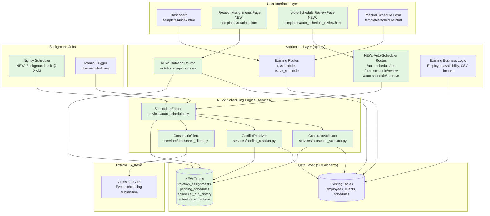
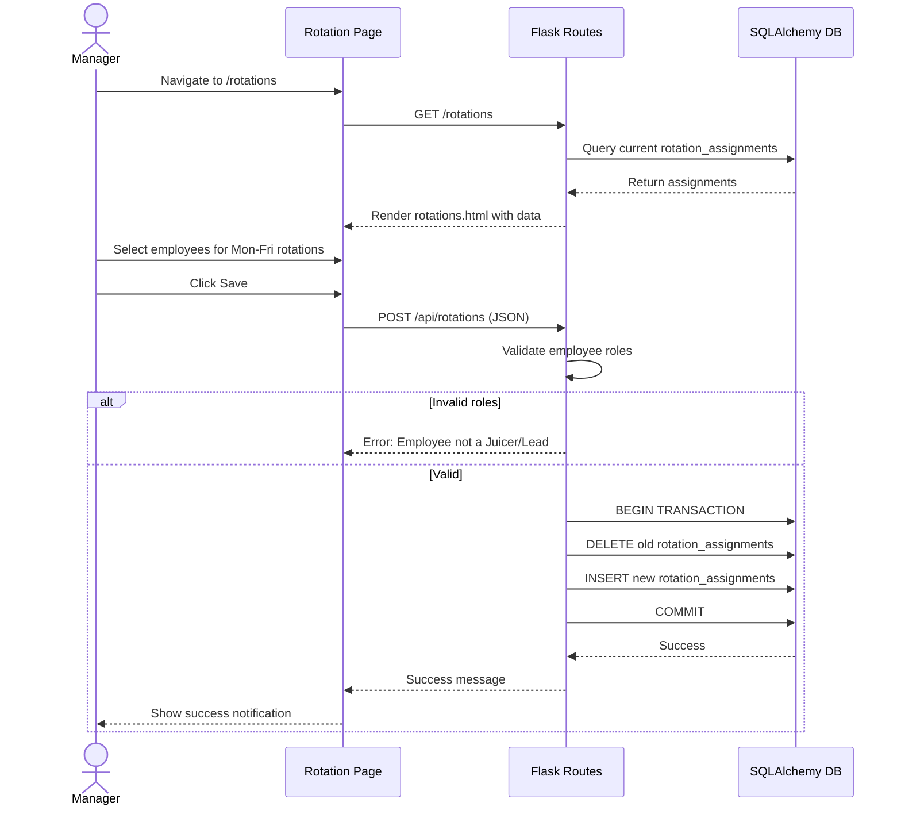
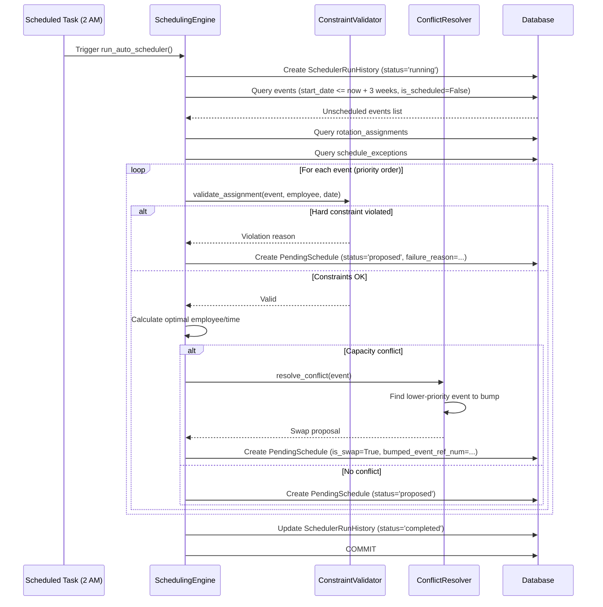
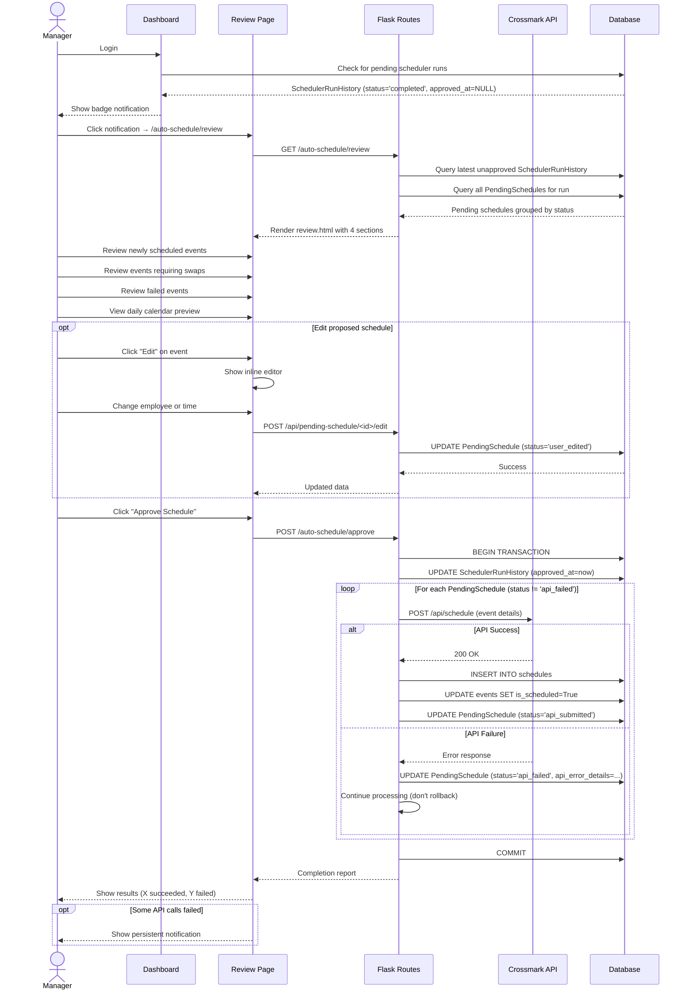
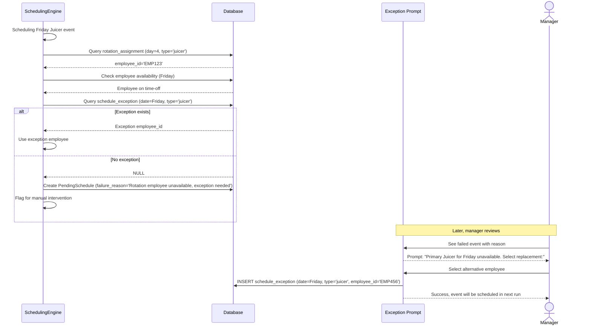
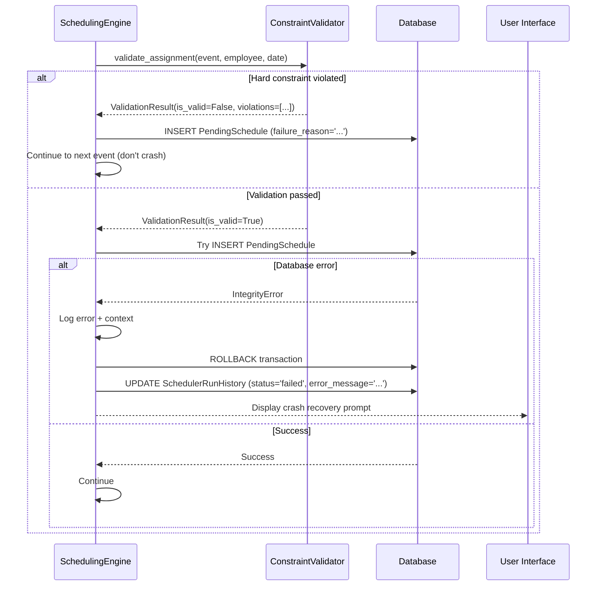

# Auto-Scheduler System Architecture Document

## Introduction

This document defines the technical architecture for the Auto-Scheduler feature to be integrated into the existing Interactive Scheduling Assistant Flask application. The auto-scheduler will automatically schedule events within a 3-week rolling window while respecting complex business rules, employee constraints, and rotation assignments.

### Relationship to Existing System

**Base System**: Brownfield Flask application (see `docs/brownfield-architecture.md`)
- Monolithic Flask application (`scheduler_app/app.py`)
- SQLite database with SQLAlchemy ORM
- Vanilla JavaScript frontend
- Comprehensive test suite (pytest)

**Integration Approach**: Extend existing monolith with new modules while maintaining architectural consistency.

### Change Log

| Date       | Version | Description                              | Author        |
| ---------- | ------- | ---------------------------------------- | ------------- |
| 2025-10-01 | 1.0     | Initial auto-scheduler architecture design | Winston, Architect |

---

## High Level Architecture

### Technical Summary

The Auto-Scheduler extends the existing Flask monolith with three major new subsystems:

1. **Rotation Management** - Weekly rotation configuration UI and storage for Juicer and Primary Lead assignments
2. **Scheduling Engine** - Constraint-based scheduling algorithm with priority logic and conflict resolution
3. **Proposal Management** - User approval workflow with editable proposed schedules and API execution tracking

The system operates on a **propose-then-approve** pattern: nightly batch jobs generate proposed schedules based on business rules, managers review and potentially edit proposals via web UI, and only after explicit approval does the system execute API calls to submit schedules to Crossmark.

**Architectural Principles**:
- **Extend, don't replace** - Build on existing patterns (`app.py`, SQLAlchemy, pytest)
- **User control first** - Never auto-execute; always require approval
- **Graceful degradation** - Log failures, notify users, allow manual intervention
- **Data-driven constraints** - Business rules encoded as validatable constraints

### System Architecture Diagram



### Architectural Patterns

- **Monolithic Extension Pattern**: Add new modules to existing `app.py` rather than refactoring to microservices
  - _Rationale_: Maintains consistency with existing architecture; appropriate for single-user local application scope

- **Service Layer Pattern**: Extract complex scheduling logic into dedicated service modules (`services/auto_scheduler.py`)
  - _Rationale_: Keeps routing layer thin; enables testability and future refactoring

- **Repository Pattern (Lightweight)**: Database access abstracted through SQLAlchemy models with helper methods
  - _Rationale_: Consistent with existing pattern; supports transaction management and testing

- **Constraint Validation Pattern**: Business rules expressed as composable constraint validators
  - _Rationale_: Enables complex rule evaluation, clear error messaging, and rule evolution

- **Proposal-Approval Workflow Pattern**: Two-phase commit (propose → approve → execute)
  - _Rationale_: User control, auditability, ability to edit before committing

- **Background Job Pattern**: Scheduled tasks run via system scheduler (cron/Task Scheduler) or APScheduler
  - _Rationale_: Non-blocking execution; allows overnight processing

---

## Tech Stack Extensions

The auto-scheduler extends the existing tech stack with minimal new dependencies:

| Category            | Technology                  | Version | Purpose                                   | Rationale                                                      |
| ------------------- | --------------------------- | ------- | ----------------------------------------- | -------------------------------------------------------------- |
| **Task Scheduling** | APScheduler (or cron)       | 3.10+   | Background job scheduling                 | Python-native, integrates with Flask, supports one-time/recurring jobs |
| **Date Handling**   | python-dateutil             | 2.8+    | Date arithmetic and timezone handling     | Robust date range calculations for 3-week window               |
| **Request Library** | requests (already in stack) | -       | Crossmark API calls                       | Already used in existing edr_generator.py                      |
| **Background Tasks**| Flask-APScheduler (optional)| 1.13+   | Flask integration for APScheduler         | Provides Flask-friendly task management (alternative to cron)  |

**Existing Stack** (unchanged):
- Python 3.13+
- Flask 3.0.0
- SQLAlchemy 2.0.36
- SQLite
- pytest 7.4.3
- Vanilla JavaScript (ES6+)

---

## Data Models

### Existing Models (Extended)

**Employee Model** (no changes needed)
```python
class Employee(db.Model):
    id = db.Column(db.String, primary_key=True)
    name = db.Column(db.String, nullable=False)

    # Existing relationships
    schedules = db.relationship('Schedule', backref='employee')
```

**Event Model** (add enum for event types)
```python
from enum import Enum

class EventType(Enum):
    CORE = "core"
    SUPERVISOR = "supervisor"
    DIGITAL_SETUP = "digital_setup"
    DIGITAL_REFRESH = "digital_refresh"
    DIGITAL_TEARDOWN = "digital_teardown"
    FREEOSK = "freeosk"
    OTHER = "other"
    JUICER = "juicer"

class Event(db.Model):
    id = db.Column(db.Integer, primary_key=True)
    project_name = db.Column(db.Text, nullable=False)
    project_ref_num = db.Column(db.Integer, nullable=False, unique=True)
    location_mvid = db.Column(db.Text)
    store_number = db.Column(db.Integer)
    store_name = db.Column(db.Text)
    start_datetime = db.Column(db.DateTime, nullable=False)
    due_datetime = db.Column(db.DateTime, nullable=False)
    estimated_time = db.Column(db.Integer)
    is_scheduled = db.Column(db.Boolean, default=False, nullable=False)

    # NEW: Event type classification
    event_type = db.Column(db.Enum(EventType), nullable=False, default=EventType.CORE)

    # NEW: Crossmark-specific reference for Supervisor events
    parent_event_ref_num = db.Column(db.Integer, db.ForeignKey('events.project_ref_num'), nullable=True)
```

**Schedule Model** (no changes needed)
```python
class Schedule(db.Model):
    id = db.Column(db.Integer, primary_key=True)
    event_ref_num = db.Column(db.Integer, db.ForeignKey('events.project_ref_num'))
    employee_id = db.Column(db.String, db.ForeignKey('employees.id'))
    schedule_datetime = db.Column(db.DateTime, nullable=False)

    __table_args__ = (db.Index('idx_schedules_date', 'schedule_datetime'),)
```

### New Models

**RotationAssignment Model**
```python
class RotationAssignment(db.Model):
    __tablename__ = 'rotation_assignments'

    id = db.Column(db.Integer, primary_key=True)
    day_of_week = db.Column(db.Integer, nullable=False)  # 0=Monday, 4=Friday
    rotation_type = db.Column(db.String(20), nullable=False)  # 'juicer' or 'primary_lead'
    employee_id = db.Column(db.String, db.ForeignKey('employees.id'), nullable=False)

    # Unique constraint: one assignment per day-type combination
    __table_args__ = (
        db.UniqueConstraint('day_of_week', 'rotation_type', name='uq_rotation'),
    )

    employee = db.relationship('Employee', backref='rotation_assignments')
```

**PendingSchedule Model**
```python
class PendingSchedule(db.Model):
    __tablename__ = 'pending_schedules'

    id = db.Column(db.Integer, primary_key=True)
    scheduler_run_id = db.Column(db.Integer, db.ForeignKey('scheduler_run_history.id'), nullable=False)
    event_ref_num = db.Column(db.Integer, db.ForeignKey('events.project_ref_num'), nullable=False)
    employee_id = db.Column(db.String, db.ForeignKey('employees.id'), nullable=False)
    schedule_datetime = db.Column(db.DateTime, nullable=False)
    schedule_time = db.Column(db.Time, nullable=False)  # Time portion for display

    # Status tracking
    status = db.Column(db.String(20), default='proposed')  # proposed, user_edited, approved, api_submitted, api_failed

    # Conflict tracking
    is_swap = db.Column(db.Boolean, default=False)  # True if this requires bumping another event
    bumped_event_ref_num = db.Column(db.Integer, db.ForeignKey('events.project_ref_num'), nullable=True)
    swap_reason = db.Column(db.Text, nullable=True)

    # Failure tracking
    failure_reason = db.Column(db.Text, nullable=True)
    api_error_details = db.Column(db.Text, nullable=True)
    api_submitted_at = db.Column(db.DateTime, nullable=True)

    created_at = db.Column(db.DateTime, default=datetime.utcnow)
    updated_at = db.Column(db.DateTime, default=datetime.utcnow, onupdate=datetime.utcnow)

    # Relationships
    event = db.relationship('Event', foreign_keys=[event_ref_num], backref='pending_schedules')
    employee = db.relationship('Employee', backref='pending_schedules')
    bumped_event = db.relationship('Event', foreign_keys=[bumped_event_ref_num])
```

**SchedulerRunHistory Model**
```python
class SchedulerRunHistory(db.Model):
    __tablename__ = 'scheduler_run_history'

    id = db.Column(db.Integer, primary_key=True)
    run_type = db.Column(db.String(20), nullable=False)  # 'automatic' or 'manual'
    started_at = db.Column(db.DateTime, nullable=False, default=datetime.utcnow)
    completed_at = db.Column(db.DateTime, nullable=True)

    # Run results
    status = db.Column(db.String(20), nullable=False)  # 'running', 'completed', 'failed', 'crashed'
    total_events_processed = db.Column(db.Integer, default=0)
    events_scheduled = db.Column(db.Integer, default=0)
    events_requiring_swaps = db.Column(db.Integer, default=0)
    events_failed = db.Column(db.Integer, default=0)

    error_message = db.Column(db.Text, nullable=True)

    # Approval tracking
    approved_at = db.Column(db.DateTime, nullable=True)
    approved_by_user = db.Column(db.String, nullable=True)  # Future: user ID when auth added

    # Relationships
    pending_schedules = db.relationship('PendingSchedule', backref='scheduler_run', cascade='all, delete-orphan')
```

**ScheduleException Model**
```python
class ScheduleException(db.Model):
    __tablename__ = 'schedule_exceptions'

    id = db.Column(db.Integer, primary_key=True)
    exception_date = db.Column(db.Date, nullable=False)
    rotation_type = db.Column(db.String(20), nullable=False)  # 'juicer' or 'primary_lead'
    employee_id = db.Column(db.String, db.ForeignKey('employees.id'), nullable=False)

    reason = db.Column(db.Text, nullable=True)
    created_at = db.Column(db.DateTime, default=datetime.utcnow)

    # Unique constraint: one exception per date-type combination
    __table_args__ = (
        db.UniqueConstraint('exception_date', 'rotation_type', name='uq_exception'),
    )

    employee = db.relationship('Employee', backref='schedule_exceptions')
```

---

## Database Schema

### Migration Strategy

Since the existing system uses manual database recreation (acceptable for local apps), we'll follow the same pattern with a migration function:

```sql
-- New tables to be created

CREATE TABLE rotation_assignments (
    id INTEGER PRIMARY KEY AUTOINCREMENT,
    day_of_week INTEGER NOT NULL CHECK(day_of_week >= 0 AND day_of_week <= 4),
    rotation_type VARCHAR(20) NOT NULL CHECK(rotation_type IN ('juicer', 'primary_lead')),
    employee_id VARCHAR NOT NULL,
    FOREIGN KEY (employee_id) REFERENCES employees(id),
    UNIQUE (day_of_week, rotation_type)
);

CREATE TABLE scheduler_run_history (
    id INTEGER PRIMARY KEY AUTOINCREMENT,
    run_type VARCHAR(20) NOT NULL CHECK(run_type IN ('automatic', 'manual')),
    started_at DATETIME NOT NULL DEFAULT CURRENT_TIMESTAMP,
    completed_at DATETIME,
    status VARCHAR(20) NOT NULL CHECK(status IN ('running', 'completed', 'failed', 'crashed')),
    total_events_processed INTEGER DEFAULT 0,
    events_scheduled INTEGER DEFAULT 0,
    events_requiring_swaps INTEGER DEFAULT 0,
    events_failed INTEGER DEFAULT 0,
    error_message TEXT,
    approved_at DATETIME,
    approved_by_user VARCHAR
);

CREATE TABLE pending_schedules (
    id INTEGER PRIMARY KEY AUTOINCREMENT,
    scheduler_run_id INTEGER NOT NULL,
    event_ref_num INTEGER NOT NULL,
    employee_id VARCHAR NOT NULL,
    schedule_datetime DATETIME NOT NULL,
    schedule_time TIME NOT NULL,
    status VARCHAR(20) DEFAULT 'proposed' CHECK(status IN ('proposed', 'user_edited', 'approved', 'api_submitted', 'api_failed')),
    is_swap BOOLEAN DEFAULT 0,
    bumped_event_ref_num INTEGER,
    swap_reason TEXT,
    failure_reason TEXT,
    api_error_details TEXT,
    api_submitted_at DATETIME,
    created_at DATETIME DEFAULT CURRENT_TIMESTAMP,
    updated_at DATETIME DEFAULT CURRENT_TIMESTAMP,
    FOREIGN KEY (scheduler_run_id) REFERENCES scheduler_run_history(id) ON DELETE CASCADE,
    FOREIGN KEY (event_ref_num) REFERENCES events(project_ref_num),
    FOREIGN KEY (employee_id) REFERENCES employees(id),
    FOREIGN KEY (bumped_event_ref_num) REFERENCES events(project_ref_num)
);

CREATE INDEX idx_pending_schedules_run ON pending_schedules(scheduler_run_id);
CREATE INDEX idx_pending_schedules_status ON pending_schedules(status);

CREATE TABLE schedule_exceptions (
    id INTEGER PRIMARY KEY AUTOINCREMENT,
    exception_date DATE NOT NULL,
    rotation_type VARCHAR(20) NOT NULL CHECK(rotation_type IN ('juicer', 'primary_lead')),
    employee_id VARCHAR NOT NULL,
    reason TEXT,
    created_at DATETIME DEFAULT CURRENT_TIMESTAMP,
    FOREIGN KEY (employee_id) REFERENCES employees(id),
    UNIQUE (exception_date, rotation_type)
);

-- Extend existing events table
ALTER TABLE events ADD COLUMN event_type VARCHAR(20) DEFAULT 'core' CHECK(event_type IN ('core', 'supervisor', 'digital_setup', 'digital_refresh', 'digital_teardown', 'freeosk', 'other', 'juicer'));
ALTER TABLE events ADD COLUMN parent_event_ref_num INTEGER REFERENCES events(project_ref_num);
```

---

## Core Workflows

### Workflow 1: Rotation Configuration



### Workflow 2: Automatic Nightly Scheduler Run



### Workflow 3: Manager Review and Approval



### Workflow 4: Rotation Exception Handling



---

## Components

### Component 1: SchedulingEngine

**Responsibility:** Core auto-scheduling orchestrator; implements priority-based assignment algorithm

**Key Interfaces:**
- `run_auto_scheduler(run_type: str) -> SchedulerRunHistory`: Main entry point for automatic/manual runs
- `schedule_rotation_events(run: SchedulerRunHistory) -> None`: Phase 1 - Juicer/Digital events
- `schedule_core_events(run: SchedulerRunHistory) -> None`: Phase 2 - Core events by priority
- `schedule_supervisor_events(run: SchedulerRunHistory) -> None`: Phase 3 - Auto-pair Supervisor events

**Dependencies:** ConstraintValidator, ConflictResolver, RotationAssignment model

**Technology Stack:** Pure Python service class, injected into Flask app context

**Implementation Notes:**
- Priority queue for due date sorting
- Two-phase processing: rotations first, then core events
- Transaction boundaries around each run

### Component 2: ConstraintValidator

**Responsibility:** Validate scheduling assignments against hard and soft constraints

**Key Interfaces:**
- `validate_assignment(event: Event, employee: Employee, date: datetime) -> ValidationResult`: Check all constraints
- `get_available_employees(event: Event, date: datetime) -> List[Employee]`: Filter by constraints
- `check_availability(employee: Employee, date: datetime, time: time) -> bool`: Availability window check
- `check_time_off(employee: Employee, date: datetime) -> bool`: Time-off request check
- `check_role_requirements(event: Event, employee: Employee) -> bool`: Role-based restrictions
- `check_daily_limit(employee: Employee, date: datetime) -> bool`: Max events per day

**Dependencies:** Employee, Event, Schedule models; future: TimeOff model when implemented

**Technology Stack:** Pure Python validation class

**Implementation Notes:**
```python
@dataclass
class ValidationResult:
    is_valid: bool
    violations: List[ConstraintViolation]

@dataclass
class ConstraintViolation:
    constraint_type: str  # 'availability', 'time_off', 'role', 'daily_limit', etc.
    message: str
    severity: str  # 'hard' or 'soft'
```

### Component 3: ConflictResolver

**Responsibility:** Handle capacity conflicts and implement bumping strategy

**Key Interfaces:**
- `resolve_conflict(event: Event, date: datetime) -> SwapProposal | None`: Find event to bump
- `calculate_priority_score(event: Event) -> float`: Due date urgency scoring
- `find_bumpable_events(date: datetime, employee: Employee) -> List[Event]`: Get swap candidates
- `validate_swap(high_priority_event: Event, low_priority_event: Event) -> bool`: Ensure swap is safe

**Dependencies:** Event, Schedule, PendingSchedule models

**Technology Stack:** Pure Python service class

**Implementation Notes:**
- Priority scoring: `(due_date - today).days` (lower = higher urgency)
- Never bump events within 2 days of due date
- Prefer bumping events with furthest due dates

### Component 4: CrossmarkClient

**Responsibility:** Handle all Crossmark API interactions for schedule submission

**Key Interfaces:**
- `submit_schedule(event: Event, employee: Employee, schedule_datetime: datetime) -> SubmissionResult`: Submit single event
- `authenticate() -> bool`: Re-authenticate if session expired
- `retry_failed_submission(pending_schedule: PendingSchedule) -> SubmissionResult`: Manual retry

**Dependencies:** requests library, existing EDRGenerator authentication flow

**Technology Stack:** Python requests, reuses auth from `services/edr_generator.py`

**Implementation Notes:**
- One-at-a-time submission (no batching)
- Detailed error logging (HTTP status, response body, timestamp)
- Continue-on-failure pattern (don't stop entire approval on single API error)

### Component 5: RotationManager

**Responsibility:** Manage rotation assignments and exceptions

**Key Interfaces:**
- `get_rotation_employee(date: datetime, rotation_type: str) -> Employee | None`: Get assigned employee for date/type
- `set_rotation(day_of_week: int, rotation_type: str, employee: Employee) -> None`: Update rotation
- `add_exception(date: datetime, rotation_type: str, employee: Employee, reason: str) -> None`: One-time override
- `get_exceptions(date_range: Tuple[datetime, datetime]) -> List[ScheduleException]`: Query exceptions

**Dependencies:** RotationAssignment, ScheduleException, Employee models

**Technology Stack:** Pure Python service class

---

## API Specification (New Endpoints)

### Rotation Management APIs

**GET /rotations**
- **Purpose**: Render rotation configuration page
- **Response**: HTML page with current rotation assignments
- **Auth**: None (local app)

**GET /api/rotations**
- **Purpose**: Fetch current rotation assignments (AJAX)
- **Response**:
```json
{
  "juicer": {
    "monday": "EMP001",
    "tuesday": "EMP002",
    "wednesday": "EMP001",
    "thursday": "EMP002",
    "friday": "EMP001"
  },
  "primary_lead": {
    "monday": "LEAD001",
    "tuesday": "LEAD002",
    "wednesday": "LEAD001",
    "thursday": "LEAD002",
    "friday": "LEAD001"
  }
}
```

**POST /api/rotations**
- **Purpose**: Update rotation assignments
- **Request Body**:
```json
{
  "juicer": {
    "monday": "EMP001",
    "tuesday": "EMP002",
    ...
  },
  "primary_lead": { ... }
}
```
- **Response**: `{ "success": true, "message": "Rotations updated" }`
- **Errors**: 400 if invalid employee IDs or roles

### Auto-Scheduler APIs

**POST /api/auto-schedule/run**
- **Purpose**: Manually trigger scheduler (doesn't wait for nightly run)
- **Request Body**: `{ "run_type": "manual" }`
- **Response**:
```json
{
  "success": true,
  "run_id": 42,
  "message": "Scheduler run started"
}
```
- **Processing**: Synchronous execution (blocks until complete, max 60s timeout)

**GET /api/auto-schedule/status/<run_id>**
- **Purpose**: Check scheduler run status
- **Response**:
```json
{
  "run_id": 42,
  "status": "completed",
  "started_at": "2025-10-01T02:00:00",
  "completed_at": "2025-10-01T02:03:15",
  "events_scheduled": 25,
  "events_requiring_swaps": 3,
  "events_failed": 2
}
```

**GET /auto-schedule/review**
- **Purpose**: Render proposal review page
- **Response**: HTML page with 4 sections (newly scheduled, swaps, failed, daily preview)

**GET /api/auto-schedule/pending**
- **Purpose**: Fetch pending schedule data (AJAX for review page)
- **Response**:
```json
{
  "run_id": 42,
  "newly_scheduled": [ ... ],
  "swaps": [ ... ],
  "failed": [ ... ],
  "daily_preview": { "2025-10-01": [ ... ] }
}
```

**PUT /api/pending-schedule/<id>**
- **Purpose**: Edit a proposed schedule before approval
- **Request Body**:
```json
{
  "employee_id": "EMP003",
  "schedule_datetime": "2025-10-02T10:00:00"
}
```
- **Response**: `{ "success": true, "updated_schedule": { ... } }`

**POST /auto-schedule/approve**
- **Purpose**: Approve proposed schedule and execute API calls
- **Request Body**: `{ "run_id": 42 }`
- **Response**:
```json
{
  "success": true,
  "api_submitted": 25,
  "api_failed": 2,
  "failed_events": [
    {
      "event_id": 123,
      "error": "Crossmark API timeout"
    }
  ]
}
```
- **Processing**: Synchronous API submission (may take several minutes)

### Exception Management APIs

**POST /api/rotation-exception**
- **Purpose**: Add one-time rotation exception
- **Request Body**:
```json
{
  "date": "2025-10-15",
  "rotation_type": "juicer",
  "employee_id": "EMP999",
  "reason": "Primary juicer on vacation"
}
```
- **Response**: `{ "success": true, "exception_id": 5 }`

---

## Project Structure Extensions

```
flask-schedule-webapp/
├── scheduler_app/
│   ├── app.py                          # EXTENDED: Add new routes and models
│   ├── services/                        # NEW: Service layer modules
│   │   ├── __init__.py
│   │   ├── auto_scheduler.py           # SchedulingEngine
│   │   ├── constraint_validator.py     # ConstraintValidator
│   │   ├── conflict_resolver.py        # ConflictResolver
│   │   ├── rotation_manager.py         # RotationManager
│   │   └── crossmark_client.py         # CrossmarkClient (extend existing edr_generator.py)
│   ├── templates/
│   │   ├── index.html                  # EXTENDED: Add auto-schedule notification badge
│   │   ├── rotations.html               # NEW: Rotation configuration UI
│   │   └── auto_schedule_review.html    # NEW: Proposal review UI
│   ├── static/
│   │   ├── js/
│   │   │   ├── main.js                 # EXTENDED: Add rotation and review page logic
│   │   │   ├── rotations.js            # NEW: Rotation page JavaScript
│   │   │   └── auto_schedule_review.js # NEW: Review page JavaScript
│   │   └── css/
│   │       └── style.css               # EXTENDED: Add styles for new pages
│   ├── migrations/                      # NEW: Database migration scripts
│   │   └── add_auto_scheduler_tables.py
│   ├── test_auto_scheduler.py           # NEW: Auto-scheduler tests
│   ├── test_constraints.py              # NEW: Constraint validation tests
│   └── requirements.txt                # EXTENDED: Add APScheduler, python-dateutil
├── docs/
│   ├── brownfield-architecture.md       # Existing
│   ├── auto-scheduler-architecture.md   # THIS DOCUMENT
│   └── brainstorming-session-results.md # Existing requirements doc
└── scripts/
    └── run_scheduler_cron.py            # NEW: Cron/Task Scheduler entry point
```

---

## Implementation Phases (Detailed)

### Phase 1: Foundation (Week 1)

**Database Schema**
- [ ] Create migration script: `migrations/add_auto_scheduler_tables.py`
- [ ] Add models to `app.py`: RotationAssignment, SchedulerRunHistory, PendingSchedule, ScheduleException
- [ ] Add `event_type` and `parent_event_ref_num` columns to Event model
- [ ] Test database creation and rollback

**Rotation Configuration UI**
- [ ] Create `templates/rotations.html` with Monday-Friday dropdowns
- [ ] Add routes: `GET /rotations`, `POST /api/rotations`, `GET /api/rotations`
- [ ] Create `static/js/rotations.js` for AJAX employee loading
- [ ] Add navigation link to dashboard
- [ ] Write pytest tests: test_rotation_page, test_save_rotations, test_invalid_roles

**Constraint Validator Service**
- [ ] Create `services/constraint_validator.py` with ValidationResult dataclass
- [ ] Implement hard constraints: availability, time-off, role requirements, daily limit
- [ ] Implement `get_available_employees()` filter function
- [ ] Write pytest tests: test_constraint_violations, test_available_employees_filter

**Deliverable**: Rotation management page working with database persistence and validation

---

### Phase 2: Scheduling Engine (Weeks 2-3)

**Rotation Manager Service**
- [ ] Create `services/rotation_manager.py`
- [ ] Implement `get_rotation_employee()` with exception support
- [ ] Implement exception creation and querying
- [ ] Write pytest tests: test_rotation_lookup, test_exception_override

**Scheduling Engine Core**
- [ ] Create `services/auto_scheduler.py` with `run_auto_scheduler()` entry point
- [ ] Implement event filtering (3-week window, unscheduled only)
- [ ] Implement priority ordering (due date, event type)
- [ ] Implement Phase 1 scheduling: rotation-based events (Juicer, Digital)
- [ ] Implement Phase 2 scheduling: core events with priority
- [ ] Implement Phase 3 scheduling: supervisor event auto-pairing
- [ ] Write comprehensive pytest tests: test_priority_ordering, test_rotation_scheduling, test_core_event_scheduling

**Conflict Resolver Service**
- [ ] Create `services/conflict_resolver.py`
- [ ] Implement priority scoring algorithm
- [ ] Implement `find_bumpable_events()` logic
- [ ] Implement swap proposal generation
- [ ] Write pytest tests: test_priority_scoring, test_bumping_logic, test_swap_proposals

**Manual Trigger Route**
- [ ] Add route: `POST /api/auto-schedule/run`
- [ ] Add route: `GET /api/auto-schedule/status/<run_id>`
- [ ] Add "Run Auto-Scheduler" button to dashboard
- [ ] Write integration tests: test_manual_trigger, test_run_status

**Deliverable**: Scheduling engine generates pending schedules; manual trigger working

---

### Phase 3: Proposal Review & Approval (Weeks 4-5)

**Review UI**
- [ ] Create `templates/auto_schedule_review.html` with 4 sections
- [ ] Implement Section 1: Newly Scheduled Events table
- [ ] Implement Section 2: Events Requiring Swaps table (side-by-side comparison)
- [ ] Implement Section 3: Daily Schedule Preview (calendar visualization)
- [ ] Implement Section 4: Failed Events table with reasons
- [ ] Create `static/js/auto_schedule_review.js` for interactivity
- [ ] Add route: `GET /auto-schedule/review`
- [ ] Add route: `GET /api/auto-schedule/pending`

**Editable Proposals**
- [ ] Add inline editing UI to review page
- [ ] Add route: `PUT /api/pending-schedule/<id>`
- [ ] Implement edit validation (preserve constraints)
- [ ] Write pytest tests: test_edit_pending_schedule, test_edit_validation

**Dashboard Notifications**
- [ ] Extend `templates/index.html` with notification badge
- [ ] Add database check for unapproved runs on dashboard load
- [ ] Implement click-through navigation to review page
- [ ] Write tests: test_dashboard_notification, test_notification_badge

**Approval Workflow (WITHOUT API calls yet)**
- [ ] Add route: `POST /auto-schedule/approve` (mock API calls)
- [ ] Implement transaction: approve → create schedules → mark events scheduled
- [ ] Add completion report UI
- [ ] Write pytest tests: test_approve_workflow, test_schedule_creation

**Deliverable**: Full review UI working; approval creates schedules in database (no API yet)

---

### Phase 4: API Integration (Week 6)

**Crossmark Client Service**
- [ ] Create `services/crossmark_client.py` extending existing edr_generator.py patterns
- [ ] Implement `submit_schedule()` with detailed logging
- [ ] Implement retry logic for transient failures
- [ ] Implement authentication reuse from existing EDRGenerator
- [ ] Write integration tests: test_api_submission, test_api_failure_handling

**Approval with API Execution**
- [ ] Extend `POST /auto-schedule/approve` to call CrossmarkClient
- [ ] Implement one-at-a-time sequential submission
- [ ] Implement failure tracking (update PendingSchedule.api_error_details)
- [ ] Implement persistent notification for failed API calls
- [ ] Write integration tests: test_approve_with_api, test_partial_failures

**Persistent Notification System**
- [ ] Add notification table/model for unresolved failures
- [ ] Add notification badge to dashboard (separate from proposal notification)
- [ ] Implement "Retry Failed Submissions" UI
- [ ] Add route: `POST /api/auto-schedule/retry/<pending_schedule_id>`
- [ ] Write tests: test_persistent_notification, test_retry_submission

**Deliverable**: Full end-to-end workflow including API submission; failure handling working

---

### Phase 5: Polish & Production-Ready (Week 7)

**Background Job Setup**
- [ ] Install and configure APScheduler (or document cron setup)
- [ ] Create `scripts/run_scheduler_cron.py` entry point
- [ ] Configure nightly run at 2 AM
- [ ] Implement job locking (prevent concurrent runs)
- [ ] Write tests: test_cron_trigger, test_job_locking

**Crash Recovery**
- [ ] Add crash detection on dashboard (status='running' but old timestamp)
- [ ] Implement "Run now or dismiss?" prompt UI
- [ ] Add route: `POST /api/auto-schedule/dismiss-crash`
- [ ] Implement auto-recovery: update status to 'crashed' and allow re-run
- [ ] Write tests: test_crash_detection, test_crash_recovery

**Exception Handling UI**
- [ ] Add "Create Exception" modal to review page
- [ ] Add route: `POST /api/rotation-exception`
- [ ] Implement exception management page (view/delete exceptions)
- [ ] Write tests: test_create_exception, test_exception_scheduling

**Data Retention**
- [ ] Implement auto-purge job (delete SchedulerRunHistory > 3 weeks old)
- [ ] Add CASCADE delete to clean up related PendingSchedules
- [ ] Add retention configuration (default 3 weeks, configurable)
- [ ] Write tests: test_data_purge, test_cascade_delete

**Analytics & Summary View**
- [ ] Create `templates/scheduler_history.html` for run history
- [ ] Add route: `GET /auto-schedule/history`
- [ ] Implement summary metrics: success rate, avg events/run, failure trends
- [ ] Add charts/visualizations (optional: use Chart.js or similar)
- [ ] Write tests: test_history_page, test_summary_metrics

**Deliverable**: Production-ready auto-scheduler with background jobs, crash recovery, and analytics

---

## Coding Standards (Auto-Scheduler Specific)

### Critical Rules

- **Service Layer Isolation**: All scheduling logic must live in `services/` modules, not in route handlers
  - _Rationale_: Testability, reusability, separation of concerns

- **Transaction Boundaries**: Each scheduler run must be a single database transaction with rollback on failure
  - _Rationale_: Data integrity; prevent partial state on crashes

- **Never Auto-Execute**: All API submissions require explicit user approval
  - _Rationale_: User control, auditability, error recovery

- **Constraint Validation First**: Always validate before creating PendingSchedule entries
  - _Rationale_: Fail fast; clear error messages

- **Logging is Mandatory**: All API calls, constraint violations, and failures must be logged with context
  - _Rationale_: Debuggability, audit trail

### Naming Conventions

| Element              | Convention       | Example                              |
| -------------------- | ---------------- | ------------------------------------ |
| Service Classes      | PascalCase       | `SchedulingEngine`, `ConflictResolver` |
| Service Methods      | snake_case       | `run_auto_scheduler()`, `validate_assignment()` |
| Database Models      | PascalCase       | `RotationAssignment`, `PendingSchedule` |
| Table Names          | snake_case       | `rotation_assignments`, `pending_schedules` |
| Routes               | kebab-case       | `/auto-schedule/review`, `/api/rotations` |
| Enums                | PascalCase       | `EventType.CORE`, `EventType.JUICER` |
| Constants            | UPPER_SNAKE_CASE | `MAX_EVENTS_PER_DAY = 1` |

---

## Error Handling Strategy

### Error Categories

1. **Constraint Violations** (User-facing)
   - Example: "Employee is on time-off for selected date"
   - Handling: Store in PendingSchedule.failure_reason; display in Failed Events section

2. **API Failures** (External system)
   - Example: "Crossmark API timeout"
   - Handling: Store in PendingSchedule.api_error_details; allow manual retry; persistent notification

3. **System Crashes** (Internal errors)
   - Example: Scheduler process killed mid-run
   - Handling: Detect via status='running' + old timestamp; prompt user on login

4. **Data Integrity Errors** (Database)
   - Example: Foreign key violation
   - Handling: Rollback transaction; log error; mark run as 'failed'

### Error Flow



### Error Response Format (JSON APIs)

```typescript
interface ApiErrorResponse {
  success: false;
  error: {
    code: string;          // e.g., 'VALIDATION_ERROR', 'API_TIMEOUT', 'DATABASE_ERROR'
    message: string;       // Human-readable message
    details?: any;         // Optional: structured error details
    timestamp: string;     // ISO 8601 timestamp
  };
}
```

**Example**:
```json
{
  "success": false,
  "error": {
    "code": "INVALID_EMPLOYEE_ROLE",
    "message": "Employee EMP123 is not a Lead Event Specialist and cannot be assigned to Digital Setup events",
    "details": {
      "employee_id": "EMP123",
      "required_role": "Lead Event Specialist",
      "actual_role": "Event Specialist"
    },
    "timestamp": "2025-10-01T14:32:15Z"
  }
}
```

---

## Testing Strategy

### Test Pyramid

```
        E2E Tests (5%)
       Integration Tests (30%)
      Unit Tests (65%)
```

### Test Organization

**Unit Tests** (`services/` modules):
```
scheduler_app/tests/
├── unit/
│   ├── test_constraint_validator.py   # Constraint logic
│   ├── test_conflict_resolver.py      # Bumping logic
│   ├── test_rotation_manager.py       # Rotation lookup
│   └── test_auto_scheduler_logic.py   # Priority ordering, filtering
```

**Integration Tests** (routes + database):
```
scheduler_app/tests/
├── integration/
│   ├── test_rotation_routes.py        # Rotation CRUD
│   ├── test_auto_schedule_routes.py   # Manual trigger, status check
│   ├── test_approval_workflow.py      # Full approve flow
│   └── test_crossmark_integration.py  # API client (mocked)
```

**E2E Tests** (browser-based, optional):
```
scheduler_app/tests/
├── e2e/
│   └── test_full_workflow.py          # Selenium: configure rotations → run → review → approve
```

### Test Examples

**Unit Test: Constraint Validation**
```python
# tests/unit/test_constraint_validator.py

def test_validate_time_off_constraint(app, db):
    """Employee on time-off should fail validation"""
    with app.app_context():
        # Setup
        employee = Employee(id='EMP001', name='John Doe')
        event = Event(project_ref_num=123, event_type=EventType.CORE, ...)
        # Assume TimeOff model exists: TimeOff(employee_id='EMP001', date='2025-10-15')

        validator = ConstraintValidator()
        result = validator.validate_assignment(event, employee, datetime(2025, 10, 15))

        assert not result.is_valid
        assert any(v.constraint_type == 'time_off' for v in result.violations)
        assert 'time-off' in result.violations[0].message.lower()

def test_validate_role_requirement(app, db):
    """Event Specialist should not be assigned to Freeosk events"""
    with app.app_context():
        employee = Employee(id='EMP002', name='Jane Smith', role='Event Specialist')
        event = Event(project_ref_num=456, event_type=EventType.FREEOSK, ...)

        validator = ConstraintValidator()
        result = validator.validate_assignment(event, employee, datetime.now())

        assert not result.is_valid
        assert any(v.constraint_type == 'role' for v in result.violations)
```

**Integration Test: Approval Workflow**
```python
# tests/integration/test_approval_workflow.py

def test_approve_schedule_creates_schedules(client, app, db):
    """Approving a run should create Schedule entries and mark events scheduled"""
    with app.app_context():
        # Setup: Create SchedulerRunHistory with PendingSchedules
        run = SchedulerRunHistory(run_type='manual', status='completed')
        db.session.add(run)
        db.session.flush()

        event = Event(project_ref_num=789, is_scheduled=False, ...)
        employee = Employee(id='EMP003', name='Alice')
        db.session.add_all([event, employee])

        pending = PendingSchedule(
            scheduler_run_id=run.id,
            event_ref_num=789,
            employee_id='EMP003',
            schedule_datetime=datetime(2025, 10, 20, 10, 0),
            schedule_time=time(10, 0),
            status='proposed'
        )
        db.session.add(pending)
        db.session.commit()

        # Execute
        response = client.post('/auto-schedule/approve', json={'run_id': run.id})

        # Assert
        assert response.status_code == 200
        data = response.get_json()
        assert data['success'] is True
        assert data['api_submitted'] == 1

        # Check database changes
        schedule = Schedule.query.filter_by(event_ref_num=789).first()
        assert schedule is not None
        assert schedule.employee_id == 'EMP003'

        event = Event.query.filter_by(project_ref_num=789).first()
        assert event.is_scheduled is True

        pending = PendingSchedule.query.get(pending.id)
        assert pending.status == 'api_submitted'
```

---

## Monitoring and Observability

### Key Metrics to Track

**Scheduler Performance**:
- Average run duration
- Events processed per run
- Success rate (% events scheduled)
- Swap frequency (% events requiring bumps)

**API Integration**:
- Crossmark API success rate
- Average API response time
- API timeout frequency
- Retry success rate

**User Behavior**:
- Approval time (time from run completion to approval)
- Edit frequency (% proposals edited before approval)
- Manual trigger frequency

### Logging Strategy

**Log Levels**:
- **DEBUG**: Detailed constraint evaluation, priority scoring
- **INFO**: Scheduler run start/end, approval actions, API calls
- **WARNING**: Constraint violations, swap proposals
- **ERROR**: API failures, database errors, validation errors
- **CRITICAL**: Scheduler crashes, data integrity issues

**Log Format**:
```python
import logging

logger = logging.getLogger(__name__)

# Example log statements
logger.info(f"Scheduler run {run.id} started: {total_events} events to process")
logger.warning(f"Event {event.id} requires swap: {swap_reason}")
logger.error(f"Crossmark API failed for event {event.id}: {error_details}")
```

**Log Destinations**:
- Console (development)
- File: `logs/auto_scheduler.log` (production)
- Future: Centralized logging service (if multi-user deployment)

---

## Security Considerations

### Current Security Posture

**Existing Security** (inherited from base app):
- CSRF protection via Flask sessions
- SQL injection prevention via SQLAlchemy ORM
- Input sanitization for form data

**Auto-Scheduler Additions**:
- **API Authentication**: Reuse existing Crossmark authentication from `edr_generator.py`
- **Session Management**: No additional auth needed (local app)
- **Input Validation**: All dates, employee IDs, event IDs validated before database operations
- **Transaction Safety**: All scheduler runs wrapped in database transactions with rollback

### Future Security Enhancements

When evolving to multi-user:
- Role-based access control (only managers can approve schedules)
- Audit logging (who approved, when, what was changed)
- API rate limiting for manual trigger (prevent abuse)
- Encrypted credential storage for Crossmark API

---

## Performance Optimization

### Database Optimization

**Indexes**:
```sql
-- Already exists
CREATE INDEX idx_schedules_date ON schedules(schedule_datetime);

-- Add for auto-scheduler
CREATE INDEX idx_pending_schedules_run ON pending_schedules(scheduler_run_id);
CREATE INDEX idx_pending_schedules_status ON pending_schedules(status);
CREATE INDEX idx_events_type ON events(event_type);
CREATE INDEX idx_events_scheduled ON events(is_scheduled, due_datetime);
```

**Query Optimization**:
- Use `db.session.query().filter().all()` instead of loading all events and filtering in Python
- Eager loading for relationships: `db.session.query(Event).options(db.joinedload(Event.schedules))`
- Batch inserts for PendingSchedule creation

### Frontend Optimization

**Review Page Performance**:
- Lazy-load daily calendar preview (only render visible week initially)
- Paginate large pending schedule lists (if > 100 events)
- Debounce inline edit autosave (500ms delay)

**AJAX Optimization**:
- Cache rotation employee lists (invalidate on rotation update)
- Use HTTP 304 Not Modified for status polling

---

## Deployment Strategy

### Local Deployment (Current)

**No changes to existing deployment**:
- Run `python app.py` as usual
- Database auto-migrated on first run
- Background scheduler configured via cron/Task Scheduler

**Cron Setup (Linux/Mac)**:
```bash
# Edit crontab
crontab -e

# Add nightly run at 2 AM
0 2 * * * cd /path/to/flask-schedule-webapp/scheduler_app && /path/to/venv/bin/python scripts/run_scheduler_cron.py >> /var/log/auto_scheduler.log 2>&1
```

**Task Scheduler (Windows)**:
```xml
<!-- Create Windows Task Scheduler task -->
<!-- Trigger: Daily at 2:00 AM -->
<!-- Action: Start a program -->
<!-- Program: C:\path\to\venv\Scripts\python.exe -->
<!-- Arguments: C:\path\to\scheduler_app\scripts\run_scheduler_cron.py -->
```

### Future: Multi-User Deployment

If evolving to web-hosted multi-user app:
- **Frontend**: Deploy Flask app to cloud VM (AWS EC2, Azure VM)
- **Database**: Migrate from SQLite to PostgreSQL
- **Background Jobs**: Use Celery + Redis for distributed task queue
- **Monitoring**: Add application monitoring (Datadog, New Relic)

---

## Appendix: Data Flow Examples

### Example: Nightly Scheduler Run Data

**Input** (3 weeks from now = 2025-10-22):
- Unscheduled events: 30 events (various types)
- Rotation assignments: 2 Juicers, 3 Leads configured Mon-Fri
- Existing schedules: 15 events already scheduled

**Processing**:
1. Filter events: `start_datetime <= 2025-10-22 AND is_scheduled = False` → 30 events
2. Sort by priority: Due date ascending, then event type (Juicer > Digital > Core > Supervisor)
3. Phase 1 (Rotations):
   - 5 Juicer events → Assign to rotation employees → 5 PendingSchedules created
   - 10 Digital events → Assign to Primary/Secondary Leads → 10 PendingSchedules created
4. Phase 2 (Core):
   - 12 Core events → Assign to Leads (priority), then Event Specialists → 12 PendingSchedules created
   - 1 Core event → Capacity conflict → ConflictResolver finds event to bump → 1 Pending Schedule (is_swap=True)
5. Phase 3 (Supervisor):
   - 3 Supervisor events → Auto-pair with corresponding Core events → 3 PendingSchedules created (Club Supervisor @ Noon)

**Output** (PendingSchedules table):
- 31 PendingSchedule rows created (30 new + 1 bumped)
- 1 SchedulerRunHistory row (status='completed', events_scheduled=30, events_requiring_swaps=1)

**User Review**:
- Section 1 (Newly Scheduled): 29 events
- Section 2 (Swaps): 1 event (show both high-priority and bumped event)
- Section 3 (Daily Preview): Calendar with 30 events distributed across 3 weeks
- Section 4 (Failed): 0 events

**Approval**:
- User clicks "Approve"
- 30 API calls to Crossmark (sequential, ~1 second each)
- 28 succeed → 28 Schedule rows created, events marked `is_scheduled=True`
- 2 fail (API timeout) → PendingSchedule.status='api_failed', error details logged
- Dashboard shows persistent notification: "2 events failed to submit. Retry?"

---

## Summary

This auto-scheduler architecture extends the existing monolithic Flask application with a sophisticated scheduling engine while maintaining architectural consistency. The **propose-then-approve pattern** ensures user control, the **constraint validation system** enforces business rules, and the **graceful failure handling** prevents data corruption.

**Key Design Principles Achieved**:
✅ **Extend, don't replace** - Builds on existing app.py patterns
✅ **User control first** - Never auto-executes without approval
✅ **Data-driven constraints** - Business rules as validatable constraints
✅ **Graceful degradation** - Continues on errors, logs failures, allows recovery
✅ **Testability** - Service layer enables comprehensive unit/integration testing
✅ **Phased implementation** - 7-week roadmap with deliverables

**Next Steps**:
1. Review this architecture document for completeness
2. Begin Phase 1 implementation (database schema + rotation UI)
3. Write tests alongside each component (TDD approach)
4. Iterate based on user feedback after each phase delivery

---

**Document Status**: Draft v1.0 - Ready for Review
**Estimated Total Implementation**: 7 weeks (assuming 1 developer, full-time)
**Dependencies**: None (all extensions to existing system)
